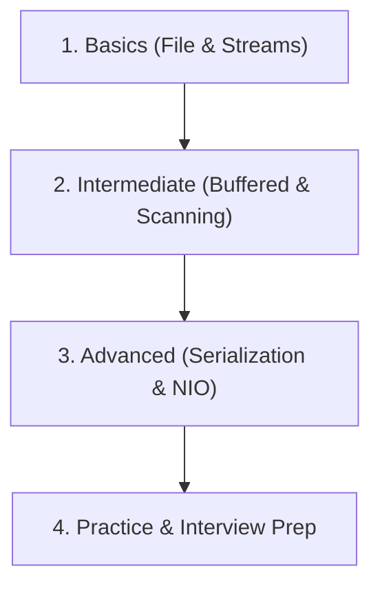

# Study Material: Java File Handling (Basic to Advanced)

Welcome to the comprehensive, exam-oriented guide on **Java File Handling**. This package is structured to help students (BCA, MCA, B.Tech) and interview candidates master I/O systems in Java.

---

## 📂 Folder Structure

```text
file handling/
├── README.md                 # Course overview and roadmap
├── notes/                    # Theory and exam notes
│   ├── 01_theory_basics.md
│   ├── 02_theory_advanced.md
│   └── 03_questions_and_tables.md
├── programs/                 # Executable Java code examples
│   ├── basic/                # File and directory lifecycle
│   ├── intermediate/         # Buffering, processing, and parsing
│   ├── advanced/             # Serialization, NIO, cryptography, and applications
│   └── practice_questions/   # Practice MCQs and exam preparation
└── output_samples/           # Output descriptions
```

---

## 🛠️ Compilation and Execution

Navigate to the `programs` directory or subdirectories to compile and execute:

```bash
# Compilation
javac basic/P01_CreateFile.java

# Execution
java basic.P01_CreateFile
```

Note: Since the files include package declarations (`package basic;`, `package intermediate;`, etc.), they should be compiled from the `programs` folder root.

---

## 🗺️ Learning Roadmap


